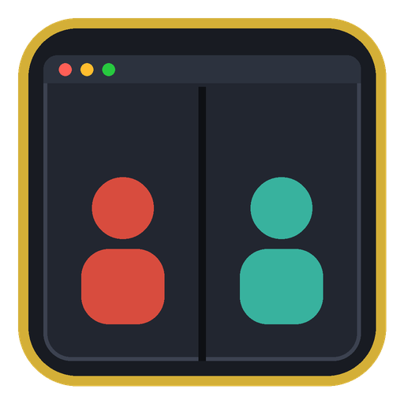

# STS2 Local Co-op (Sts2SoloCoop)



Play **Slay the Spire 2 co-op solo** — run both characters yourself, on one screen.

> 한국어: [README.ko.md](README.ko.md)

STS2 co-op is a networked lockstep (players are network peers), so a single-process "hotseat" isn't
practical — its ~10 per-choice synchronizers each wait for every player's networked vote. Instead this
project runs **two real game instances** (genuine peers → the game behaves exactly as intended) and
gives you the pieces to drive both from one place: a launcher/embedder that puts both windows in one
container, plus a small helper mod for diagnostics.

The connection itself uses a **built-in game flag, `--fastmp`**, which makes the normal Multiplayer
menu host/join over ENet on `127.0.0.1` — no Steam friend needed, no dev console.

## Download & install
Grab the ready-to-use package from **[Releases](https://github.com/ing-gom/sts2-local-coop/releases)**
(`sts2-local-coop-vX.Y.Z.zip`), then:
1. Copy the `Sts2SoloCoop/` folder into your game's mods folder:
   `…/Steam/steamapps/common/Slay the Spire 2/mods/Sts2SoloCoop/`
   (so you have `mods/Sts2SoloCoop/Sts2SoloCoop.dll`, `Sts2SoloCoop.json`, `Sts2.ModKit.dll`).
2. Keep the `tools/` folder somewhere handy — that's what you run.
3. Enable **Sts2SoloCoop** in the in-game mod list (optional; the tools + `--fastmp` work without it).

> Prefer source? Clone this repo and `dotnet build -c Release` (see [Build](#build)).

## Quick start
1. Set the game to **Windowed** mode (Settings → Video). Keep Steam running.
2. From this repo's `tools/` folder, in PowerShell:
   ```powershell
   ./coop-launch.ps1 -Windowed
   ```
   Places both instances as normal **bordered windows in a centered box (NOT fullscreen)**, side by
   side, plays **windowed**, and the in-game **cursor stays aligned**. Pick sizes with `-Width`/`-Height`.
   - add `-Seamless` for a borderless, edge-to-edge one-window look.
   - `./coop-embed.ps1` — a true single **container** window, but **full-screen only** (a *windowed*
     reparented container offsets the cursor; press Esc to close).
   - `./coop-launch.ps1` (no flag) — plain full-screen tiling (two bordered windows).

   **No PowerShell prompt?** Just double-click **`tools/Start-LocalCoop.cmd`** (runs the windowed mode).
   (Right-click it → *Create shortcut* → set its icon to `icon.ico` for a nice desktop launcher.)
3. In each panel use the game's own **Multiplayer** menu: left → **Host**, right → **Join**
   (it auto-connects to `127.0.0.1`). Pick characters, ready up, begin.
4. **Control both:** whichever panel/window has focus receives your input. Click a panel (or use
   `tools/coop-control.ahk` for `F1`/`F2` one-key focus switching).

## Co-op is a shared vote
The party travels together: the **map, events, and rewards** are shared votes that only resolve once
**every player has chosen**. So at those points act in **both** panels (e.g. to move, click the next
map node in the left panel *and* the right panel). Combat is per-player — play each on its own panel.
This is normal game behavior, not a stuck input.

## The mod (optional helper)
`Sts2SoloCoop.dll` adds in-game dev conveniences (console commands + one lobby patch). It is **not**
required to play — `--fastmp` + the tools are enough — but it helps when testing:
- `sc_probe` — dump the net type, players and their NetIds, and the local perspective.
- `sc_swap <netid>` — change `LocalContext.NetId` (the "who am I" perspective); guarded against
  invalid ids.
- `AllowSoloBegin` patch — lets a lone host begin a multiplayer-type run (solo smoke-testing).

## Build
A standard STS2 (Godot 4.5 / .NET) mod. Build the DLL and drop it (with `Sts2SoloCoop.json`) into the
game's `mods/Sts2SoloCoop/` folder:
```
dotnet build -c Release
```
(Uses the shared `Sts2.ModKit` build props; adjust the import if your layout differs.)

## Layout
| Path | What |
|---|---|
| `Sts2SoloCoopCode/` | mod source (console commands + AllowSoloBegin patch) |
| `Sts2SoloCoop.json` | mod manifest |
| `tools/Start-LocalCoop.cmd` | one-click launcher (double-click → runs `coop-embed.ps1`) |
| `icon.png` / `icon.ico` | project icon (`.ico` for a desktop-shortcut icon) |
| `tools/coop-embed.ps1` | embed both instances in one container window (grid) |
| `tools/coop-launch.ps1` | launch + tile both instances on the desktop |
| `tools/coop-control.ahk` | optional AutoHotkey v2: F1/F2/F3 focus switch, F4 re-tile |
| `tools/README.md` | full workflow details |

## Troubleshooting
- **A PowerShell script won't run** ("running scripts is disabled") → run it as
  `powershell -ExecutionPolicy Bypass -File .\coop-embed.ps1`.
- **Windows don't resize / tile / embed** → set the game to **Windowed** mode (exclusive/borderless
  fullscreen ignores window positioning).
- **The Multiplayer menu still wants a Steam friend** → both instances must be launched **with
  `--fastmp`** (the scripts do this; a Steam-launched instance won't have it). In fastmp the Join
  screen auto-connects to `127.0.0.1` and shows no friends list — that's expected.
- **Clicking the next map node does nothing** → co-op is a shared vote; click it in **both** windows.
- **In-game cursor is offset in the embedded container** → `coop-embed.ps1` reparents the games (Win32
  `SetParent`), and a child window offset from the screen origin makes Godot mis-map the mouse. That's
  why the embed container is **full-screen at (0,0)** (where cursor stays aligned) and a *windowed*
  container can't. **For windowed play, use `./coop-launch.ps1 -Windowed`** — the games stay top-level
  windows (no reparenting), so the cursor is always correct, and borderless side-by-side still looks like
  one window.
- **An embedded panel is black / unresponsive / jittering** → embedding a GPU game is fragile; close
  the container (that quits both games) and use `coop-launch.ps1` (plain desktop tiling) instead.

## Notes
- Windows only (the tools use Win32 window APIs + `--fastmp`).
- Embedding a GPU game in a container (`coop-embed.ps1`) works but is inherently a bit fragile; if a
  panel misbehaves, fall back to `coop-launch.ps1` (plain tiling).
- Not affiliated with Mega Crit. Built on Slay the Spire 2.

MIT licensed — see [LICENSE](LICENSE).
